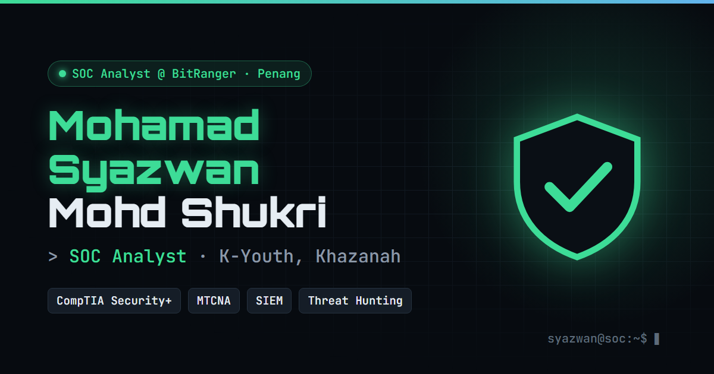

# 🛡️ mosyaz.my: SOC Analyst Portfolio

[](https://mosyaz.my)
[](https://mosyaz.my/#certifications)
[](https://mosyaz.my/#certifications)

This is the personal portfolio of **Mohamad Syazwan Mohd Shukri**. I'm a SOC Analyst at BitRanger Sdn. Bhd. through Khazanah Nasional's K-Youth Development Programme.

👉 **Live:** https://mosyaz.my



## ✨ Interactive features

| Feature | What it does |
|---|---|
| 💻 **Interactive terminal** | Type commands like `help`, `whoami`, `nmap`, `whois` and `scan` to explore my profile |
| 🚨 **Triage Lab** | Classify 8 simulated SOC alerts as true or false positives, with MITRE ATT&CK mapping for each |
| 🎣 **Phish Hunt** | Find all 8 red flags in a fictional phishing email |
| 🔄 **SOC workflow** | Step through how I handle an alert, from monitoring to report |
| 🖨️ **Print view** | Press `Ctrl+P` for a clean one-page resume layout |

All alert and phishing scenarios are fictional training examples. None of them contain real client or employer data.

## 🔐 Security by design

- **Static site.** There's no backend, database or login, so the attack surface is minimal.
- **HTTPS enforced** with a Let's Encrypt certificate, served by GitHub Pages.
- **Domain verified** on GitHub to prevent subdomain or domain takeover.
- **Minimal DNS.** Unused records like MX and FTP were removed.
- **No sensitive data.** The public resume leaves out my phone number and referee details.
- **No third-party trackers or analytics.**

## 🧰 Built with

Plain HTML, CSS and vanilla JavaScript, all in a single `index.html` with no framework or build step. Fonts come from Google Fonts (Inter, JetBrains Mono and Orbitron), and the site is hosted on GitHub Pages with a custom domain.

```
├── index.html                  # the whole site
├── og-image.png                # social link preview
├── RESUME_SYAZWAN_SHUKRI.pdf   # public resume
└── CNAME                       # custom domain: mosyaz.my
```

## 📬 Contact

- 🌐 [mosyaz.my](https://mosyaz.my)
- 💼 [linkedin.com/in/syazwan-shukri](https://www.linkedin.com/in/syazwan-shukri/)
- ✉️ syazwanshkri1@gmail.com

---

© Mohamad Syazwan Mohd Shukri. All rights reserved. You're welcome to take inspiration from the design, but please don't republish my personal content.
